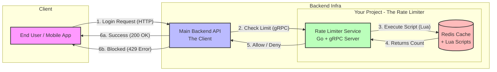

start redis
docker run -d -p 6379:6379 redis:alpine
docker ps -a
docker stop <container_id>
docker rm <container_id>

go run cmd/server/main.go
go run cmd/client/main.go

Key Notes
Rate limiting is done by User ID and action
Example:- Redis Key: rate_limit:User_123:login 

