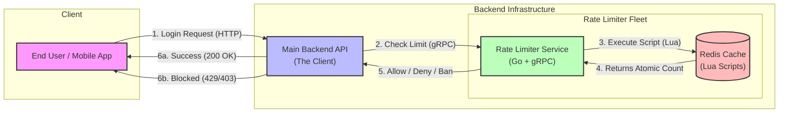

# Distributed Rate Limiter & Abuse Detection Service

A distributed rate-limiting microservice built with **Go**, **Redis**, and **gRPC**. It implements the **Token Bucket Algorithm** using atomic Lua scripts and features an **Abuse Detection** penalty system to ban repeat offenders.

## Architecture

The system follows a centralized rate-limiting pattern where multiple rate limiting service instances share a single Redis state.




### Key Concepts

* **Granularity:** Limits are applied per `User ID` + `Action`.
* *Example Key:* `rate_limit:User_123:login`


* **Distributed Fleet:** The default Docker setup runs **2 Rate Limiter instances** behind a simulated load balancer. This proves that the rate limit is enforced accurately across different servers using shared state.

---

## Getting Started

### Prerequisites

* [Docker & Docker Compose](https://www.docker.com/)
* [Go 1.23+](https://go.dev/) (Optional, for local testing)

### Option 1: Run with Docker

This spins up the entire distributed cluster: **Redis**, **Rate Limiter A** (Port 50051), and **Rate Limiter B** (Port 50052).

```bash
# Start the cluster
docker-compose up --build

# Stop the cluster
docker-compose down
```

### Option 3: Use Makefile

Same as above, this spins up **Rate Limiter A** (Port 50051), and **Rate Limiter B** (Port 50052).

```bash
make run

make stop
```

### Option 2: Run Manually (Local Dev)

If you want to run components individually:

```bash
# 1. Start Redis
docker run -d -p 6379:6379 redis:alpine

# 2. Start Server (Rate Limiter)
go run cmd/server/main.go --port=50051

# 3. Run Simulation Client (backend service in this case)
go run cmd/client/main.go
```

---

## Some future improvements in mind

1. **Hot-Path Optimized:**
* Uses **Lua Scripts** to combine "Read-Calculate-Write" operations into a single atomic step inside Redis.
* Reduces network round-trips by 50% compared to standard Go-side logic.
* Uses **SHA script loading** to minimize bandwidth usage.


2. **Shadow Mode:**
* Allows testing new rate limits in production without impacting users. The system logs "Would have blocked" errors instead of actually blocking requests.


3. **Dynamic Config Reload (Planned):**
* Watchers on config files or Redis Pub/Sub allow updating rate limits (e.g., increasing limits during a sale) without restarting the servers.


4. **Adaptive Throttling (Planned):**
* Automatically lowers rate limits when backend latency spikes, acting as a circuit breaker to prevent cascading system failures.
